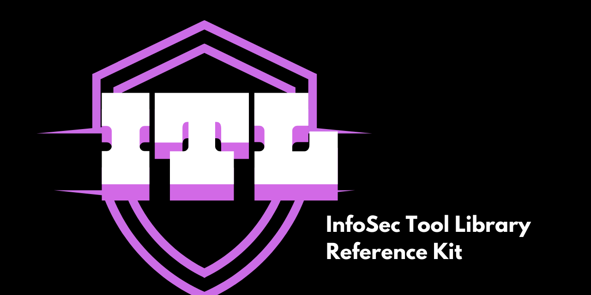

# InfoSec Tool Library Reference Kit

This repository provides information on commonly used security tools for defense and research purposes. These tools are essential for cybersecurity professionals, penetration testers, and network administrators to assess and enhance the security posture of systems and networks.

## Table of Contents

1. [Nmap](tools/nmap.md)
2. [Nikto](tools/nikto.md)
3. [SQLmap](tools/sqlmap.md)
4. [Zed Attack Proxy (ZAP)](tools/zap.md)
5. [Recon-ng](tools/recon-ng.md)
6. [The Harvester](tools/theharvester.md)
7. [TestSSL](tools/testssl.md)
8. [Empire](tools/empire.md)
9. [John the Ripper](tools/john-the-ripper.md)
10. [Bettercap](tools/bettercap.md)
11. [Dirb](tools/dirb.md)
12. [DNSRecon](tools/dnsrecon.md)
13. [Gobuster](tools/gobuster.md)
14. [Netdiscover](tools/netdiscover.md)
15. [WAFw00f](tools/wafw00f.md)
16. [WhatWeb](tools/whatweb.md)
17. [RidEnum](tools/ridenum.md)
18. [PolEnum](tools/polenum.md)
19. [SimplyEmail](tools/simplyemail.md)
20. [SNMPCheck](tools/snmpcheck.md)

## Introduction

This repository serves as a comprehensive guide to various security tools commonly used in the cybersecurity industry. Each tool has its own dedicated file with detailed information about its purpose, usage, and implementation.

## How to Use This Repository

1. Browse the table of contents above to find the tool you're interested in.
2. Click on the tool's name to view its detailed information.
3. Each tool's page includes a description, author information, usage examples, and installation instructions.

## Importance of Security Tools

These security tools play a crucial role in identifying vulnerabilities, assessing risks, and strengthening the overall security of systems and networks. They are important for several reasons:

1. **Proactive Defense**: By using these tools, security professionals can identify and address vulnerabilities before malicious actors exploit them.
2. **Compliance**: Many industry regulations require regular security assessments, which these tools can help facilitate.
3. **Continuous Monitoring**: Some of these tools can be used for ongoing monitoring of systems and networks, helping to detect new threats or changes in the security landscape.
4. **Incident Response**: In the event of a security breach, these tools can aid in investigation and remediation efforts.
5. **Education and Training**: Security tools provide hands-on experience for professionals to understand attack vectors and defense mechanisms.

## Evolving Cybersecurity Threats

The cybersecurity landscape is constantly evolving, with new threats emerging regularly. Businesses and individuals continue to face challenges such as:

- Ransomware Attacks
- Phishing and Social Engineering
- IoT Vulnerabilities
- Supply Chain Attacks
- AI-Powered Attacks
- Cloud Security Challenges

To combat these evolving threats, it's crucial for security professionals to stay informed about the latest attack techniques and defense strategies. The tools listed in this repository are valuable assets in this ongoing battle against cybersecurity threats.

## Contributing

If you'd like to contribute to this repository by adding new tools, updating information, or improving documentation, please feel free to submit a pull request.

## License

This project is licensed under the [MIT License](LICENSE).

